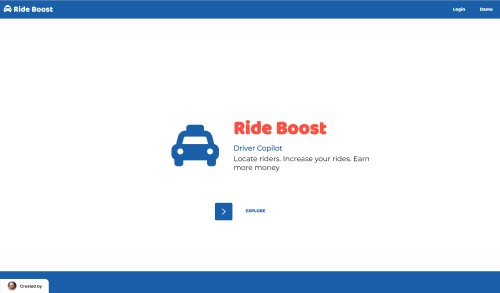
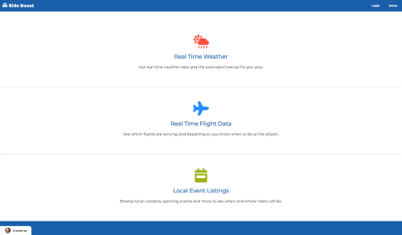
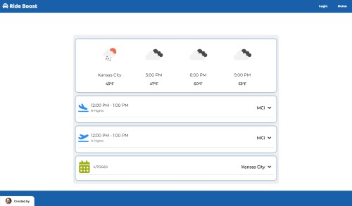
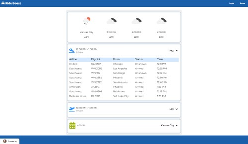
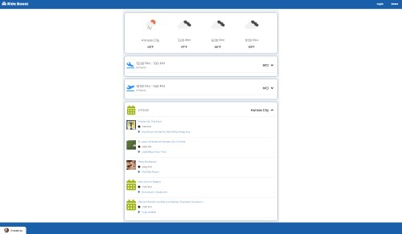
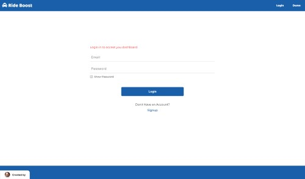
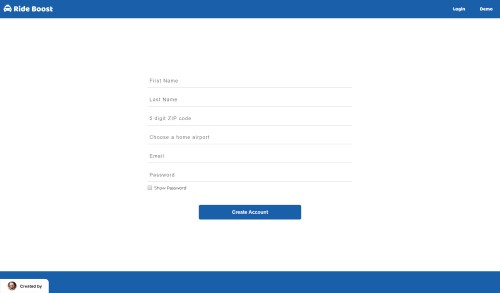

## Name

rideboost-api

## App

https://rideboost.now.sh/

## Client Repo

https://github.com/mmbmf1/rideboost-app

## Summary

The rideboost-api serves the Ride Boost app which allows users access to real time weather data, airline arrivals & departures and local events near the driver.

## Endpoint Breakdown

/api/user/dashboard/:user_id - The user endpoint returns the dashboard for the driver. The endpoint makes calls to 3 different APIs and sends the data to the client. A user must be logged in to access their dashboard.

/api/auth/login - verifies the user's login credentials

/api/auth/signup - allows a user to signup for a new account

## Tech

Express.js
Node.js
PostgeSQL
Moment.js
Unirest

## Landing Page:

## Dashboard:

## Login:

## Signup:

